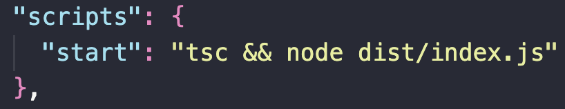
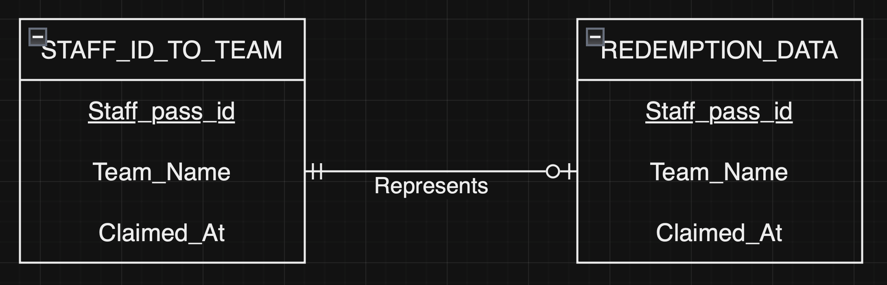

# GovWallet Assignment

## This project includes 3 basic functions for checking of Staff ID a CSV file, verifying if a team can redeem their gift, and adding new redemption data for eligible teams.

## Setting Up

### Initial Setup
1. `npm init -y` - Creates a package.json file with default values.
2. `touch index.ts` - Creates a TypeScript file, as Node.js natively understands only JavaScript.
3. `npm install typescript` - Installs TypeScript locally in the project.
4. `npx tsc --init` - Initializes a TypeScript config file.
5. `sudo npm install -g typescript` - Installs TypeScript globally on the device with admin rights.
6. `mkdir server` and `mkdir dist` - Creates server and dist directories.
7. Modify `tsconfig.json`: Change “outDir” path to `./dist`.

### Build and Run Script
9. Update `package.json`: Change “test” script to `“start”: “tsc && node dist/index.js”` - Allows running the project with `npm run start`, which compiles and runs the code.

### CSV Handling
1. `npm install csv-parser @types/node` - Installs packages to read from CSV files.
2. `npm install csv-writer` - Installs package to write into CSV files.

### Additional Test Setup
1. `npm install --save-dev ava`
3. `npm install --save-dev ts-jest`.
2. `npm install --save-dev babel-jest @babel/core @babel/preset-env`.

## Project Requirements

1. Look up the representative's staff pass ID in the mapping file.
2. Check if the team can redeem their gift by comparing the team name against past redemptions.
3. If eligible, add new redemption to the redemption data; otherwise, take no action.

## Functions

### Function 1: staffExists()
- Checks if staff pass ID exists in the mapping file.
- Constructor takes in `filePath` and `staffId`.
- Returns `true` if ID exists, `false` otherwise.

### Function 2: getStaffTeam()
- Get the team name that the staff belongs to.
- Constructor takes in `filePath` and `staffId`.
- Returns `string` type for team name.
### Function 3: canRedeem()
- Get a boolean result on wherther the team can redeem their gift.
- Constructor takes in `filePath` and `staffId`.
- Returns a `boolean` value.

### Function 4: redeemGift()
- Write the eligible `staffID`, `team_Name`, and `claimed_at` into a given CSV file.
- Constructor takes in `redemmptionFilePath`, `staffFilePath`, `staff_pass_id`.
- Returns `Already redeemed!` or `Successfully redeemed!`.

## Assumptions

- A staff member can represent at most one team.
- Each redemption is made by a single staff member from one unique team.

## Design Decisions
- Chose CSV files for redemption data storage for simplicity and speed.
- Implemented all functions in `index.ts` for quick deployment.

## Unit Test Commands
1. `npx ava staffExists.test.ts`
2. `npx ava getStaffTeam.test.ts`
3. `npx ava canRedeem.test.ts`

# Reflection on Assignment

## Biggest Takeaway
- I discovered that there are multiple libraries out there for our unit-testing.

## Biggest Challenge
- Faced difficulties in seting-up Jest and Mocha for unit-test, which presented a significant learning hurdle. But I have gained significant knowledgefrom the challenges.